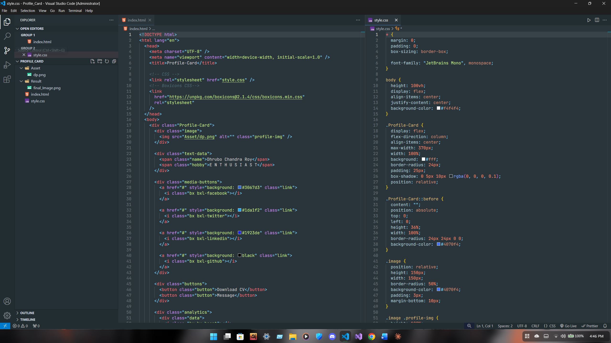

# 🚀 PROFILE CARD DESIGN

A simple and modern Profile Card UI built using HTML and CSS.  
This project focuses on clean design, layout structuring, and frontend UI practice.

---

## 📸 Result Preview

### 💻 Final Design


### 🧩 Code Snapshot


---

## 👤 Profile Image


---

## 📁 Project Structure

```
PROFILE_CARD_DESIGN/
│
├── index.html
├── style.css
│
├── Asset/
│   └── dp.png
│
├── Result/
│   ├── final-design.png
│   └── code-snapshot.png
│
└── README.md
```

---

## ✨ Features

- Clean and modern profile card UI  
- Simple and structured layout  
- Responsive-friendly design approach  
- Easy to understand HTML & CSS code  
- Beginner-friendly frontend project  

---

## 🛠️ Technologies Used

- HTML5  
- CSS3  

---

## 🚀 How to Run This Project

1. Clone the repository:
```
git clone https://github.com/dhruboxR/PROFILE_CARD_DESIGN.git
```

2. Open the project folder:
```
cd PROFILE_CARD_DESIGN
```

3. Run `index.html` in your browser.

---

## 📌 Learning Outcome

This project helped me improve:
- UI design sense  
- CSS styling and positioning  
- Layout structuring  
- Real-world frontend project organization  

---


## 📝 License

This project is open-source and free to use.
